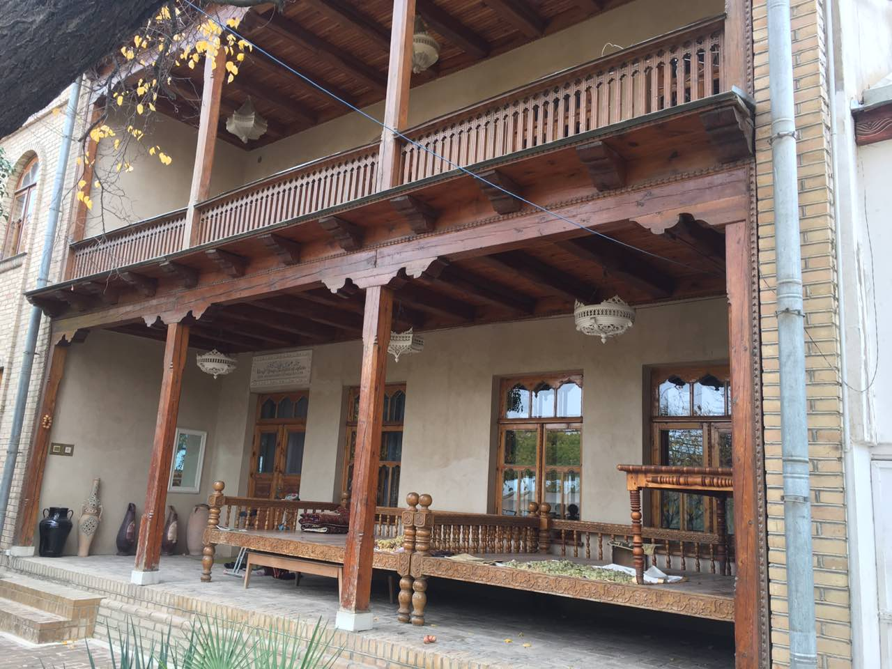

---
# Feel free to add content and custom Front Matter to this file.
# To modify the layout, see https://jekyllrb.com/docs/themes/#overriding-theme-defaults

layout: home
title: ""
---

## Our beautiful museum ##
The home-museum of Orif Gulkhany is one of the few of its kind. You will find more than 2500 items, such as articles from the day to day life in the late 19th and early 20th century, valuable manuscripts and old books on exhibition.

## The magnificent garden ##
There are also over 200 different species of plants found in the gardens of Orif Gulkhany's home-museum. These are nurtured by the current owner, and grandson of Orif Gulkhany - Mukumjon Orify, as well as his wife and grandchildren.

