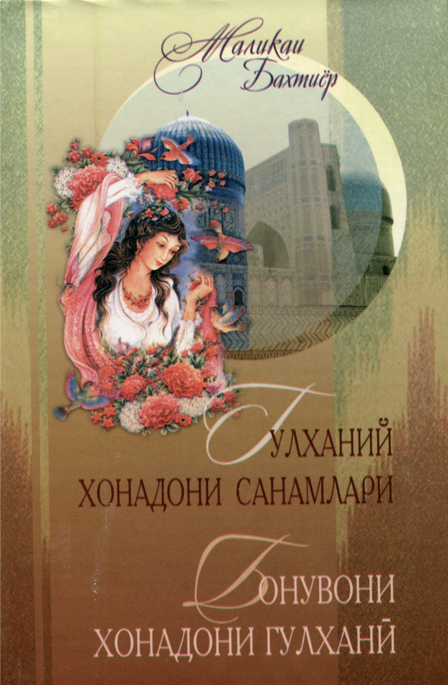
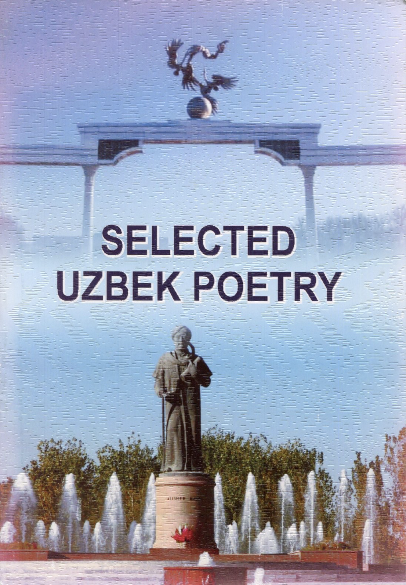
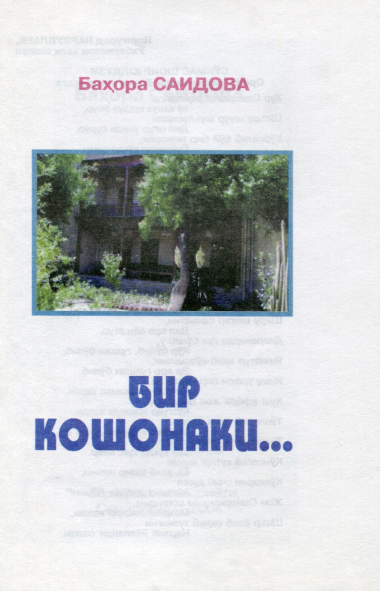

## 1. Бонувони хонадони Гулхани ##

**Year of publication:** 2015

 

## 2. Selected Uzbek Poetry ##

**Year of publication:** 2013

This collection of poems contain manifold genres of Uzbek Poetry: arooz, lyrics, romantic poems, songs, an epic poem, dramatic poem, aphorisms and children's poetry. Gulkhany's poems can be found from pages 59 to 69.

 

## 3. Бир кошонаки... ##

**Year of Publication:** 2004

 
