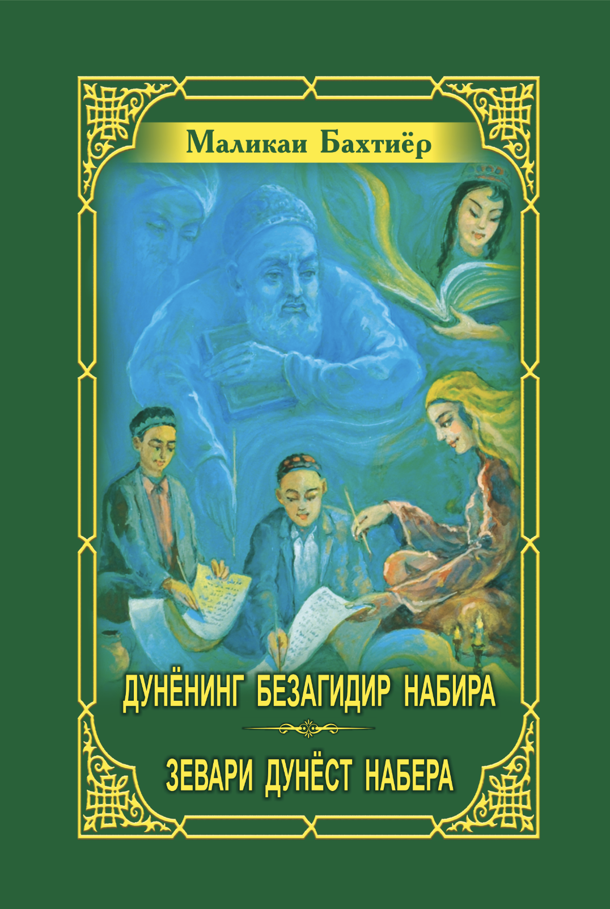
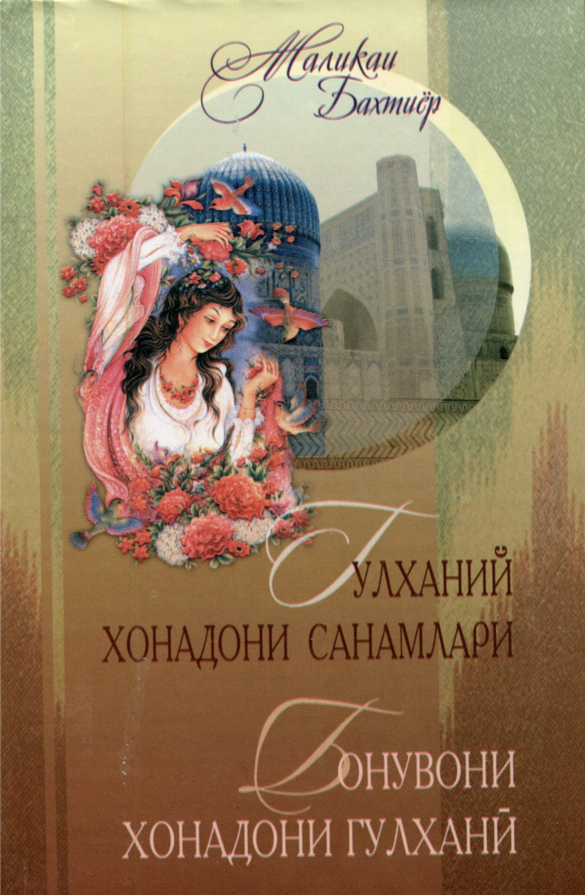
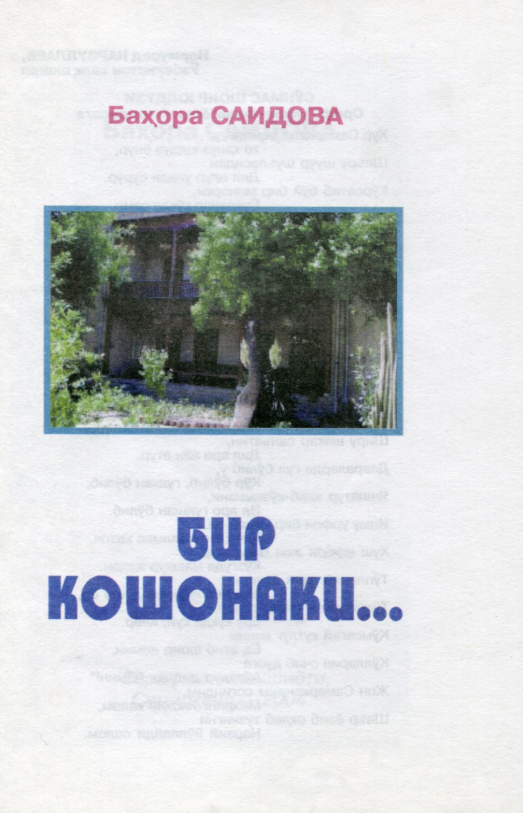
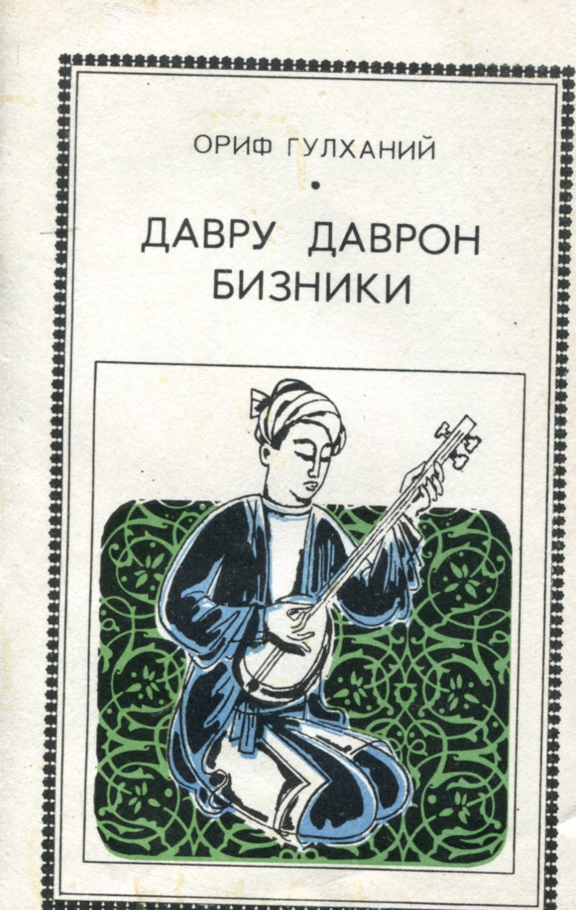

## 1. Зевари дунёст набера ##
{: width="35%" height="35%" .align_right}

**Year of publication:** 2018  
**Download:** [pdf](/resources/books/pdfs/nabira.pdf)

Дуввумин китоби Маликаи Бахтиёр маїмґаи
µикоёт аз µаёти бачагон аст. Дар он аз рафтору гуфтори ворисони хурдсоли хонаводаи Гулхании Самар³андє на³л мешавад. Зимни тасвири муносибати бобо ва набера муаллиф дар
тарбияти дурусти бачагон чє андоза муµим будани муµити солими оилавиро ифода менамояд.
Китоби мазкур барои кґдакони синни
томактабє, хонандагони синфµои ибтидоє, падару модарон ва ононе, ки бо тарбияи насли
наврас сару кор доранд, пешбинє шудааст.

{:style="clear: right"}
 

## 2. Бонувони хонадони Гулхани ##
{: width="35%" height="35%" .align_right}

**Year of publication:** 2015

Ушбу китоб шоир, маърифатпарвар - Гулханий хонадони санамлари ҳақида ҳикоя қилади. Мазкур китобда оддий, хокисор, билимга чанқоқ уй бекаларининг хаётларидаги ҳақиқий воқеа-ходисалари келтирилган. Ӯйлаймизки, бу санамларнинг хулқ-атвори, муомаласи, турли вазиятларда ӯзини тута билиши, одоби ҳар биримиз учун ибрат бӯла олади.
Мазкур китоб тарих, этнография, адабиёт ва юртимиз қадриятлари, урф-одатларига қизиқувчи барча китобхонлар учун мӯлжалланган.

{:style="clear: right"}
 

## 3. Selected Uzbek Poetry ##
{: width="35%" height="35%" .align_right}

**Year of publication:** 2013

This collection of poems contain manifold genres of Uzbek Poetry: arooz, lyrics, romantic poems, songs, an epic poem, dramatic poem, aphorisms and children's poetry. Gulkhany's poems can be found from pages 59 to 69.

{:style="clear: right"}
 

## 4. Бир кошонаки... ##
{: width="35%" height="35%" .align_right}

**Year of Publication:** 2004

Самарқандда шундай гӯшалар, сулолалар борки, халқимиз улар билан фахрланади. Гулхайнийлар сулоласи ана шундай хонадонлардан бири хисобланади. Боболар анъаналарига содиқлик, улар бошлаган ишларни давом эттириш, хусусан, меъморчилик, боғдорчилик борасидаги ибратли ишлар...
Ушбу масалалар мазкур китобчада батафсил баён этилгани билан эътиборга лойиқдир.

{:style="clear: right"}
 

## 5. Давру даврон бизники ##
{: width="35%" height="35%" .align_right}

**Year of Publication:** 1980

Маърифатпарвар шоир Ориф Гулханий инқилобдан аввал Аҳмад Дониш, Саддридин Айний бошчилигидаги тараққийпарвар зиёлилар суҳбатидан бахраманд бӯлган, ӯзи ҳам зуллисонайнлик анъанасига амал қилиб, ӯзбек ва тожик тилларида ғазаллар, мухаммаслар битган. Октябрь инқилобидан кейин Ориф Гулханий янги тузум ғалабаларини мустаҳкамлаш учун янги маориф ва маданият учун хизмат қилди. Гулханий шеърлари теран маънодорлиги, мусиқий охангдорлиги билан ажралиб туради.

{:style="clear: right"}
 
